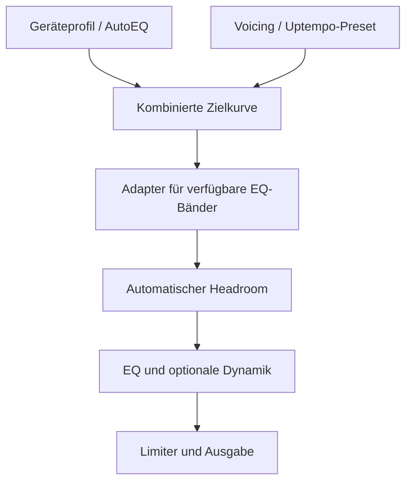

> **Verhältnis zu `roadmap.md`:** Dieses Dokument ist ab 23. September 2026 die
> aktuelle Produkt- und Technik-Roadmap und löst die Meilenstein-/
> Architekturplanung aus `roadmap.md` ab. `roadmap.md` bleibt unverändert
> bestehen als **Entwicklungs-Session-Log** (Abschnitt „Session-Log") mit der
> vollständigen bisherigen Entscheidungshistorie – bestehende Verweise wie
> „roadmap.md Session 16" oder „roadmap.md §2/§3" in Code-Kommentaren und
> PR-Beschreibungen bleiben dadurch gültig. Neue Session-Log-Einträge gehören
> weiterhin dorthin; neue Roadmap-/Meilenstein-Entscheidungen hierher.

# HardBass EQ – Produkt- und Technik-Roadmap 2026

**Stand:** 23. September 2026
**Ausgangsbasis:** Repository `kniepertsebastian-spec/equalizer`, `main` auf Commit `5f078db`
**Ziel:** Aus dem vorhandenen Prototypen einen zuverlässigen, sicheren und verständlichen Android-Equalizer für Uptempo, Hardcore und Hard Dance machen.

## 1. Zielbild

HardBass EQ soll nicht nur starke Presets anbieten. Die App muss zuverlässig erkennen, **ob**, **auf welcher Audio-Session** und **für welches Ausgabegerät** sie arbeitet. Klangkorrektur und persönliches Voicing werden getrennt behandelt:

### Produktprinzipien

1. **Zuverlässigkeit vor Funktionsmenge:** Ein kleiner EQ, der nachweisbar aktiv ist, ist wertvoller als viele Regler ohne sicheren Audio-Pfad.
2. **Gerätekorrektur und Geschmack trennen:** Kopfhörerprofil und Genre-Preset dürfen unabhängig gewählt werden.
3. **Sichere Standards:** Kein Preset darf unbemerkt digitales Clipping verursachen.
4. **Transparenz:** Die App zeigt verständlich, ob EQ, Input-Gain, MBC und Limiter tatsächlich aktiv sind.
5. **Progressive Komplexität:** Presets für Einsteiger, präzise Werkzeuge für Fortgeschrittene.
6. **Geräteabhängigkeit ernst nehmen:** Nicht unterstützte Android-Funktionen werden klar deaktiviert statt simuliert.

## 2. Definition des MVP

Das MVP ist erreicht, wenn:

- Spotify, SoundCloud und ein lokaler Referenzplayer auf den unterstützten Testgeräten zuverlässig erkannt werden;
- der aktive Status nicht nur vermutet, sondern durch Engine-Zustand und Session-ID belegt wird;
- Preset, Makros, Bypass und manuelle Änderungen einen Prozessneustart überleben;
- für mindestens Bluetooth, kabelgebundene Kopfhörer und internen Lautsprecher getrennte Profile gespeichert werden können;
- Headroom tatsächlich angewandt und ein aktiver Limiter eindeutig angezeigt wird;
- manuelle Änderungen als `Custom` erscheinen und zurückgesetzt oder gespeichert werden können;
- alle Kernpfade automatisiert getestet und auf mindestens drei realen Gerätekonfigurationen geprüft sind.

## 3. Prioritätenübersicht

| Priorität | Meilenstein | Ergebnis | Geschätzter Aufwand |
|---|---|---|---:|
| P0 | M0 – Messbare Ausgangslage | Reproduzierbare Tests statt Einzelbeobachtungen | 3–5 Tage |
| P0 | M1 – Zuverlässiger Audio-Pfad | Nachweisbare Wirkung auf Ziel-Playern | 2–3 Wochen |
| P0 | M2 – Persistenz und Custom-Workflow | Einstellungen gehen nicht mehr verloren | 1–2 Wochen |
| P1 | M3 – Geräteprofile und Korrekturebene | Richtige Kurve für den richtigen Ausgang | 2–3 Wochen |
| P1 | M4 – Headroom, Limiter und Metering | Sichere, nachvollziehbare Signalverarbeitung | 2–3 Wochen |
| P1 | M5 – AutoEQ-Workflow | Importierbare Kopfhörerkorrekturen | 2 Wochen |
| P2 | M6 – Parametrischer EQ | Präzise Filter, sofern technisch tragfähig | 3–5 Wochen |
| P2 | M7 – Release-Qualität | Stabiler Beta-/Store-Kandidat | 2–3 Wochen |

Die Schätzungen sind Richtwerte für eine Person und setzen voraus, dass keine herstellerspezifischen Android-Blocker auftreten.

---

## 4. Meilensteine

## M0 – Messbare Ausgangslage

**Zweck:** Vor weiteren Features klären, was auf welchen Geräten tatsächlich funktioniert.

### Aufgaben

- Eine reproduzierbare Testmatrix anlegen:
  - mindestens Pixel/AOSP-nahes Gerät;
  - mindestens ein Samsung-Gerät;
  - Bluetooth-Kopfhörer, interner Lautsprecher und kabelgebundener/USB-Ausgang;
  - Spotify, SoundCloud und lokaler Testplayer.
- Für jeden Testfall erfassen:
  - Player vor oder nach HardBass EQ gestartet;
  - erhaltene Session-ID;
  - Attach erfolgreich/fehlgeschlagen;
  - Kontrollverlust während Wiedergabe;
  - Verhalten nach Pause, Trackwechsel und Route-Wechsel;
  - hör- oder messbare EQ-Wirkung.
- Einen automatisierten A/B-Test mit Testsignal und deutlich messbarer Filterkurve bereitstellen.
- Diagnosereport um App-Version, Gerätefingerprint, Session-Ereignisse, Route und aktive DSP-Stufen erweitern.
- Veraltete Aussagen in Roadmap und Testdokumentation gegen den aktuellen Code abgleichen.

### Abnahmekriterien

- Jeder Fehler lässt sich mit einem dokumentierten Ablauf reproduzieren.
- Der Diagnosereport unterscheidet klar zwischen „Effekt vorhanden“, „Session angebunden“ und „Signal hörbar verändert“.
- Für jede unterstützte Gerätekonfiguration existiert mindestens ein bestandener A/B-Test.

## M1 – Zuverlässiger Audio-Pfad

**Zweck:** Der EQ muss zuverlässig wirken, bevor weitere Klangfunktionen ausgebaut werden.

### Aufgaben

- Zustandsautomat für `Detached`, `Listening`, `Attaching`, `Active`, `LostControl`, `Retrying` und `Unsupported` einführen.
- Kontrollverlust, tote Sessions und Player-Wechsel automatisch erkennen.
- Begrenztes Re-Attach mit Backoff implementieren; keine Endlosschleife und kein Akku-Spam.
- Session-Wechsel atomar behandeln und zuletzt bestätigte Einstellungen erst nach erfolgreichem Attach anwenden.
- Foreground-Service gegen Prozessneustart und fehlende Notification-Berechtigung testen.
- Eindeutigen UI-Status anzeigen:
  - **Aktiv:** Session angebunden und Einstellungen angewandt;
  - **Wartet:** keine unterstützte Session gefunden;
  - **Nicht unterstützt:** Gerät oder Player stellt keinen geeigneten Pfad bereit;
  - **Fehler:** konkrete nächste Handlung anbieten.
- Technische Produktentscheidung dokumentieren:
  - **A:** Session-basierter System-EQ bleibt Kernprodukt;
  - **B:** eigener Media3-Player für garantiertes DSP wird ergänzt;
  - **C:** Hybrid aus beidem.

### Abnahmekriterien

- Mindestens 95 % erfolgreiche Attach-Vorgänge über 50 definierte Starts je Ziel-Player und Testgerät.
- Trackwechsel, Pause/Resume und Bluetooth-Wechsel verursachen keinen dauerhaften Kontrollverlust.
- Die UI behauptet nie „Aktiv“, wenn `apply()` fehlgeschlagen ist.
- Nicht unterstützte Kombinationen werden ehrlich und ohne funktionslose Regler dargestellt.

### Release-Gate A

M1 ist ein Stop-or-Go-Punkt. Wird auf wichtigen Playern keine verlässliche Fremd-Session-Anbindung erreicht, muss vor M3 entschieden werden, ob ein eigener Player Teil des Produkts wird. Ein parametrischer System-EQ darf vorher nicht versprochen werden.

## M2 – Persistenz und Custom-Workflow

**Zweck:** Nutzerentscheidungen bleiben erhalten und sind nachvollziehbar.

### Aufgaben

- Repository-Schicht für Einstellungen und Presets implementieren.
- Folgende Werte persistent speichern:
  - Master/Bypass;
  - aktives Voicing;
  - Bass-, Punch- und Härte-Makros;
  - manuelle Bandwerte;
  - Limiter- und MBC-Auswahl;
  - zuletzt verwendetes Geräteprofil.
- Manuelle Änderung eines Presets automatisch als `Custom` markieren.
- Aktionen ergänzen:
  - Zurücksetzen auf Preset;
  - als neues Preset speichern;
  - duplizieren;
  - umbenennen;
  - löschen mit Bestätigung;
  - Undo/Redo innerhalb der laufenden Bearbeitung.
- Datenbankschema versionieren und Migrationstests einführen.
- Sicheren Fallback bei beschädigten oder inkompatiblen Daten definieren.

### Abnahmekriterien

- Alle Einstellungen überleben App-, Prozess- und Geräteneustart.
- Built-ins bleiben unveränderlich; Anpassungen erzeugen eine eigene Version.
- Migrationstests decken mindestens die vorherige Schema-Version ab.
- Ein beschädigtes Nutzerpreset kann die App nicht am Start hindern.

### Umsetzungsstand (siehe `roadmap.md` Session 19 für Details)

- ✅ Repository-Schicht (`PresetRepository`/`AppSettingsRepository`), alle
  Aktionen (Zurücksetzen/speichern/duplizieren/umbenennen/löschen), Custom-
  Markierung, Persistenz über Neustart, sicherer Fallback bei beschädigten
  Presets.
- ⏳ Migrationstests: `exportSchema` ist jetzt an, aber es gibt noch keine
  echte Vorversion zu testen (die Tabelle hatte vorher nie einen
  Schreibpfad) und keine Robolectric-/Instrumentierungs-Infrastruktur, die
  `MigrationTestHelper` bräuchte - Voraussetzung für die *nächste*
  Schemaänderung, nicht für diese.
- ❌ Undo/Redo innerhalb der laufenden Bearbeitung - bewusst zurückgestellt.

## M3 – Geräteprofile und getrennte Korrekturebene

**Zweck:** Derselbe Geschmack soll auf unterschiedlichen Kopfhörern sinnvoll funktionieren.

### Datenmodell

- `CorrectionProfile`: Kopfhörer-/Lautsprecherkorrektur, Quelle und Zielkurve.
- `VoicingPreset`: Clean Punch, Deep Rumble, Final Smash usw.
- `DeviceProfile`: stabiler Route-Fingerprint plus ausgewählte Korrektur und Voicing.
- `CustomOverrides`: manuelle Anpassungen, die auf beide Ebenen folgen.

### Aufgaben

- Datenschutzarmen, stabilen Route-Fingerprint definieren.
- Profilwechsel bei Bluetooth-, USB- und Lautsprecherwechsel implementieren.
- Konfliktregel festlegen: Manuelle Auswahl gilt bis zum nächsten Route-Wechsel.
- Korrekturkurve und Voicing mathematisch kombinieren und anschließend auf Gerätegrenzen begrenzen.
- Kombinierte Kurve und resultierenden Headroom vor Anwendung berechnen.
- Oberfläche klar trennen:
  - „Mein Kopfhörer“;
  - „Klangstil“;
  - „Feinanpassung“.

### Abnahmekriterien

- Ein Route-Wechsel lädt innerhalb von zwei Sekunden das richtige Profil.
- Lautsprecherprofil wird niemals versehentlich auf Bluetooth-Kopfhörer angewandt.
- Korrektur und Voicing können unabhängig deaktiviert werden.
- Die resultierende Kurve ist für den Nutzer sichtbar.

## M4 – Headroom, Limiter und Metering

**Zweck:** Aggressive Presets wie Final Smash müssen sicher und transparent arbeiten.

### Aufgaben

- Headroom aus der **kombinierten resultierenden Frequenzantwort** statt nur aus dem höchsten einzelnen Bandwert ableiten.
- Angewandten Input-Gain permanent anzeigen.
- Limiter-Status und verwendeten Threshold anzeigen.
- Prüfen, welche Geräte echtes Peak-/Gain-Reduction-Metering bereitstellen.
- Falls kein echtes Metering verfügbar ist, zwischen Messwert und Schätzung deutlich unterscheiden.
- Warnstufen definieren:
  - ausreichend Headroom;
  - Limiter arbeitet gelegentlich;
  - dauerhafte starke Begrenzung/zu aggressive Einstellung.
- Lautheitsabgeglichenen A/B-Modus entwickeln, soweit technisch möglich.
- MBC-Steuerung transparent machen oder bei nicht verifizierter Wirkung ausblenden.

### Abnahmekriterien

- Kein Built-in-Preset clippt bei normierten Testsignalen im unterstützten Signalpfad.
- Angezeigter und tatsächlich angewandter Input-Gain stimmen überein.
- Deaktivierter Limiter ist nachweisbar deaktiviert.
- Die Oberfläche bezeichnet keine Schätzung als echte Messung.

## M5 – AutoEQ-Workflow

**Zweck:** Nutzer können eine nachvollziehbare Kopfhörerkorrektur importieren und mit Uptempo-Presets kombinieren.

### Aufgaben

- Vorhandenen AutoEQ-Parser in einen vollständigen Importflow integrieren.
- Unterstützte Formate festlegen und dokumentieren:
  - `GraphicEQ`;
  - CSV/TSV-Frequenz-Gain;
  - parametrische Profile erst ab M6.
- Importvorschau mit Quelle, Frequenzbereich, maximalem Boost und benötigtem Headroom anzeigen.
- Ungültige, doppelte oder extreme Punkte verständlich melden.
- Import, Export und Teilen über Android Storage Access Framework/Share Sheet integrieren.
- Korrekturprofile an Geräteprofile binden.
- Herkunft und Änderungsstatus eines Profils speichern.

### Abnahmekriterien

- Gültige Profile können ohne manuelles Kopieren importiert werden.
- Vor dem Anwenden ist die resultierende Kurve sichtbar.
- Importierte Daten können exportiert und verlustfrei wieder eingelesen werden.
- Extreme Boosts werden nicht still angewandt, sondern begrenzt oder bestätigt.

## M6 – Parametrischer EQ und DSP-Entscheidung

**Zweck:** Präzise Frequenzkorrektur ermöglichen, ohne falsche Systemversprechen.

### Phase 1: Machbarkeitsprototyp

- Filtermodell für Peak, Low Shelf, High Shelf und optional High-/Low-Pass definieren.
- Parametergrenzen für Frequenz, Gain und Q festlegen.
- Referenzimplementierung mit Offline-Testsignalen gegen erwartete Frequenzantwort prüfen.
- Drei Ausführungspfade vergleichen:
  - Android `DynamicsProcessing`/Herstellereffekte;
  - eigener DSP in einem Media3-Player;
  - grafische Approximation auf Gerätebändern.
- Latenz, CPU, Akkuverbrauch, Stabilität und hörbare Artefakte messen.

### Phase 2: Produktintegration

- PEQ nur auf Pfaden anbieten, die ihn wirklich unterstützen.
- Parametrische AutoEQ-Profile importieren.
- Interaktive Kurve mit Filterpunkten, Frequenz, Gain und Q entwickeln.
- Schutz vor instabilen oder extremen Filtern einbauen.
- Copy/Paste, Bypass pro Filter und Sortierung ermöglichen.

### Abnahmekriterien

- Frequenzantwort der Referenzfilter liegt innerhalb definierter Toleranzen.
- Keine hörbaren Pops beim Ändern oder Umschalten von Filtern.
- Die UI kennzeichnet klar, wenn ein Profil nur approximiert werden kann.
- CPU- und Akku-Budget wird auf den ältesten unterstützten Testgeräten eingehalten.

### Release-Gate B

Wenn echtes PEQ für fremde Apps nicht zuverlässig möglich ist, wird es nur im eigenen Player angeboten. Der systemweite Modus bleibt dann ein grafischer, geräteabhängiger EQ. Diese Grenze muss Teil der Produktkommunikation sein.

## M7 – Release-Qualität

**Zweck:** Aus der technisch funktionierenden App einen belastbaren Beta-/Store-Kandidaten machen.

### Aufgaben

- Onboarding mit Kompatibilitätsprüfung und kurzem A/B-Hörtest.
- Vollständige deutsche und englische Lokalisierung.
- Accessibility: TalkBack, größere Schrift, Kontrast und Touch-Ziele.
- UI-Tests für Preset-, Profil- und Importflows.
- Instrumentierte Audiotests mit Sweep, Impuls, Sinus und Musikreferenzen.
- Crash- und Recovery-Tests bei Route-/Session-Wechseln.
- Datenschutztext, Open-Source-Lizenzen und Store-Beschreibung fertigstellen.
- Akkuverbrauch des Foreground-Service messen und dokumentieren.
- Signierte Beta mit strukturiertem Feedbackformular veröffentlichen.

### Abnahmekriterien

- Keine offenen P0- oder P1-Fehler.
- Kernflows bestehen auf der definierten Geräte-/Player-Matrix.
- Cold Start, Prozess-Recovery und Route-Wechsel funktionieren ohne Datenverlust.
- Eine nicht unterstützte Gerätekonfiguration führt zu einer hilfreichen Erklärung statt zu scheinbar aktiven Reglern.

---

## 5. Empfohlene technische Architektur

### Domänenpipeline

1. `CorrectionProfile` laden.
2. `VoicingPreset` laden.
3. `CustomOverrides` anwenden.
4. Zielkurven kombinieren.
5. Auf verfügbare Engine-/Gerätefähigkeiten abbilden.
6. Frequenzantwort und erforderlichen Headroom bestimmen.
7. Einstellungen atomar anwenden.
8. Ergebnis und Engine-Zustand zurücklesen beziehungsweise verifizieren.

### Komponenten

| Komponente | Verantwortung |
|---|---|
| `AudioSessionCoordinator` | Session-Erkennung, Zustandsautomat, Retry und Recovery |
| `AudioEngine` | Nur DSP-Fähigkeiten und atomare Anwendung |
| `ProfileRepository` | Geräteprofile, Zuordnung und Persistenz |
| `PresetRepository` | Built-ins und Nutzerpresets |
| `CurveComposer` | Korrektur, Voicing und Overrides kombinieren |
| `CapabilityAdapter` | Zielkurve auf tatsächlich verfügbare Filter/Bänder abbilden |
| `HeadroomCalculator` | Maximalen Boost der resultierenden Kurve bestimmen |
| `DiagnosticsRecorder` | Begrenzte lokale Zustands- und Fehlerhistorie |

ViewModels sollen keine dauerhafte Wahrheit besitzen. Sie beobachten Repositories und koordinieren UI-Aktionen; gespeicherter Zustand bleibt außerhalb des UI-Lebenszyklus erhalten.

## 6. Teststrategie

### Automatisiert

- Unit-Tests für Kurvenkombination, Interpolation, Headroom und Validierung.
- Property-Tests für Grenzwerte, NaN/Infinity und monotone Frequenzlisten.
- Migrationstests für Room.
- Contract-Tests für Fake- und Android-nahe Engine-Implementierungen.
- Golden-Tests für resultierende Built-in-Kurven.
- Instrumentierte Tests für Attach, Apply, LostControl und Re-Attach.

### Reale Geräte

Jeder Release-Kandidat wird mindestens mit folgenden Abläufen geprüft:

1. HardBass EQ zuerst starten, danach Player.
2. Player zuerst starten, danach HardBass EQ.
3. Wiedergabe pausieren, Track wechseln und fortsetzen.
4. Bluetooth während der Wiedergabe verbinden und trennen.
5. App-Oberfläche schließen, Prozess im Hintergrund weiterlaufen lassen.
6. Prozess vom System beenden und Recovery beobachten.
7. Preset und manuelle Kurve mit Testsignal messen.

## 7. Nicht-Ziele bis nach dem ersten stabilen Release

- Community- oder Cloud-Presets;
- Nutzerkonto und geräteübergreifende Synchronisation;
- Social-Funktionen;
- KI-generierte Presets;
- Raumkorrektur über Mikrofon;
- Unterstützung beliebiger historischer Android-Versionen;
- Behauptung eines universellen systemweiten PEQ ohne technischen Nachweis.

## 8. Unmittelbar nächster Sprint

### Sprintziel

**Nachweisbare, reproduzierbare Session-Zuverlässigkeit statt weiterer Presets.**

### Sprint-Backlog

1. Testmatrix und reproduzierbare Abläufe aus M0 anlegen.
2. Session-Ereignisprotokoll mit Zeitstempeln ergänzen.
3. Zustandsautomat für `LostControl` und `Retrying` spezifizieren.
4. Spotify und SoundCloud in vier Startreihenfolgen testen.
5. Messbaren A/B-Test mit Testton oder Sweep integrieren.
6. Entscheidungsvorlage für Session-EQ versus eigener Player erstellen.
7. Erst danach Implementierung des Re-Attach-Mechanismus beginnen.

### Sprint-Abschluss

- Es liegt eine ausgefüllte Matrix mit mindestens zwei Playern und zwei Audio-Routen vor.
- Jeder Fehlschlag enthält Diagnosedaten und einen reproduzierbaren Ablauf.
- Die technische Richtung für M1 ist entschieden.

### Umsetzungsstand Sprint 0 (siehe `roadmap.md` Session-Log für Details)

- ✅ Punkt 2 (Session-Ereignisprotokoll mit Zeitstempeln): `DiagnosticsRecorder` umgesetzt.
- ✅ Punkt 5 (Sweep als zweites Testsignal): `LogarithmicSweepGenerator` in die M0-Spike-Werkzeuge eingebunden.
- ✅ Punkt 1 (Testmatrix-Vorlage) und Punkt 6 (Entscheidungsvorlage): als ausfüllbare Vorlagen in `docs/TEST_MATRIX.md` bzw. `docs/DECISIONS.md` ergänzt – **die eigentlichen Gerätetests und die Entscheidung selbst sind nicht durch Code ersetzbar** und bleiben offen.
- ✅ Punkt 3 (Zustandsautomat `LostControl`/`Retrying` spezifizieren): Spezifikation in `docs/STATE_MACHINE.md` – Ziel-Zustandsmenge (inkl. neuer `Listening`-/`Retrying`-Zustände, Wegfall des toten `Suspended`-Zustands), Übergangstabelle, Backoff-Policy (5 Versuche, 2s–30s) und UI-Status-Mapping. **Die eigentliche Umsetzung in `AudioEngineState.kt`/`AndroidAudioEngine.kt` ist M1-Arbeit und bleibt offen.**
- ⏳ Punkt 4 (vier Startreihenfolgen auf echten Geräten testen): Schritt-für-Schritt-Ausführungsanleitung in `docs/TEST_MATRIX.md` ("Ausführungsanleitung für Punkt 4") ergänzt. Erste reale Rückmeldung (24. September 2026): Spotify wird erkannt, SoundCloud und YouTube nicht – erwartetes Verhalten des rein Broadcast-basierten Session-Mechanismus, siehe `docs/TEST_MATRIX.md` "Reale Rückmeldung". Ein Versuch, das über `AudioManager.AudioPlaybackCallback` broadcast-unabhängig zu lösen, **scheiterte am CI-Build** (die benötigten `AudioPlaybackConfiguration`-Member sind entgegen der Annahme kein Teil der öffentlichen Android-API) und wurde zurückgerollt. Es gibt aktuell keinen bekannten Code-Weg, der SoundCloud/YouTube für den Session-basierten Ansatz erreichbar macht – siehe `docs/DECISIONS.md` Release-Gate A, das damit näher an eine B/C-Entscheidung (eigener Player/Audio-Capture) rückt.
- Punkt 7 (Re-Attach-Implementierung) bewusst **nicht** begonnen, wie im Sprint-Backlog selbst gefordert ("erst danach") – zusätzlich blockiert durch das noch offene Punkt 4.
- **Damit ist Sprint 0 vollständig so weit umgesetzt, wie es ohne echte Geräte und ohne die Produktentscheidung (Punkt 6) aus Punkt 1 möglich ist.** Die verbleibenden Schritte erfordern zwingend menschliches Handeln (Gerätetests, Entscheidung), siehe `docs/TEST_MATRIX.md` und `docs/DECISIONS.md`.

## 9. Release-Kennzahlen

| Kennzahl | Zielwert |
|---|---:|
| Erfolgreiche Attach-Vorgänge auf unterstützten Kombinationen | ≥ 95 % |
| Dauer bis aktiver EQ nach neuer Session | ≤ 2 s |
| Dauer bis korrektes Profil nach Route-Wechsel | ≤ 2 s |
| Datenverlust nach Prozessneustart | 0 |
| Built-in-Presets mit digitalem Clipping im Referenztest | 0 |
| Offene P0/P1-Fehler beim Release | 0 |
| Absturzfreie Beta-Sitzungen | ≥ 99,5 % |

## 10. Reihenfolge, die nicht übersprungen werden sollte

**M0 → M1 → M2 → M3 → M4 → M5 → M6 → M7**

M2 kann teilweise parallel zu M1 vorbereitet werden. M3 bis M5 dürfen erst auf einem belastbaren Audio-Pfad aufbauen. M6 ist bewusst spät eingeordnet: Ein parametrischer EQ ist wertvoll, aber erst dann, wenn klar ist, auf welchem Android-Signalpfad er zuverlässig ausgeführt werden kann.
